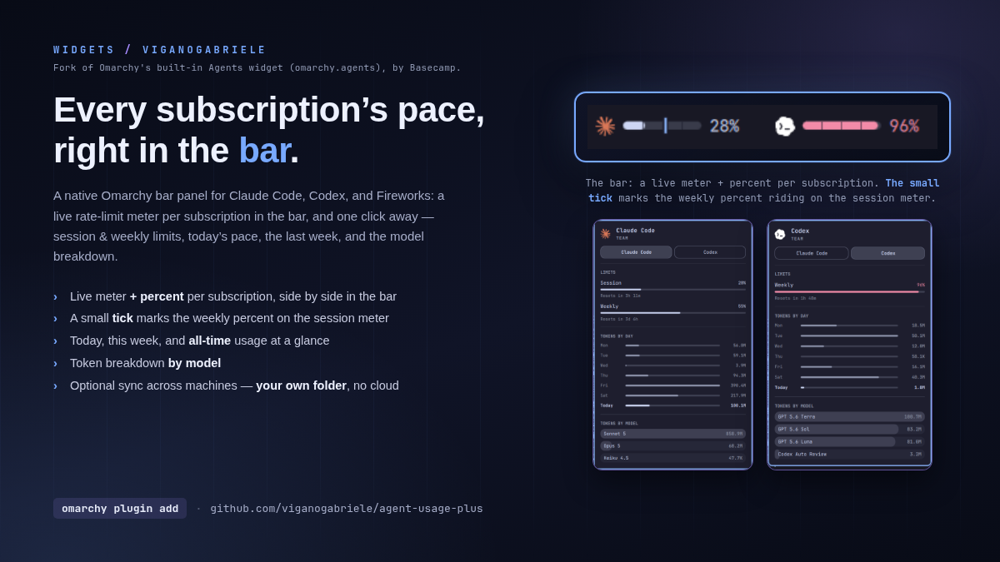

# Agent Usage Plus

[](LICENSE)



A fork of Omarchy's built-in `omarchy.agents` bar widget (Omarchy 4.0.0-1,
plugin version 1.0.0), published standalone so it can evolve independently.

The main thing this fork adds — a live meter and percentage per subscription
side by side in the bar, instead of the stock version's single icon. Click
one to open its panel: session and weekly limits, today's pace, the last
week, and the model breakdown. Codex currently reports only a weekly limit
(no session window), so its tab shows a single meter instead of the
session+weekly pair Claude gets.

Changes from the built-in version:

- The bar shows a live meter (and percentage) per enabled subscription
  side by side, instead of a single icon. A subscription can be enabled
  without taking up bar space via the per-provider `showInBar` setting
  below — it then stays reachable as a chip in the panel.
- Panel opens on click only (the stock widget also opened on hover; some
  users found that too eager while just passing the cursor over the bar).
- A secondary tick marks the weekly percentage on top of the session meter
  when a provider reports both windows (Claude does; Codex currently
  reports only a weekly window, so its bar already shows that number
  directly with nothing to tick).
- The panel can expand (chevron button or `e`) to show a combined "tokens
  by model" table across every enabled subscription at once, on top of the
  single-subscription view the chip switcher already gives you. It's
  session-only — the panel always reopens collapsed.
- A separate gear button opens a SETTINGS section: per-provider
  enabled/show-in-bar toggles, and a refresh-interval stepper and
  warn/critical threshold sliders, all writing through `omarchy bar set` so
  the CLI and the panel never disagree about how a setting gets persisted.
  Settings and the expanded data view are mutually exclusive — opening one
  closes the other, so the panel never has to grow tall enough to show both
  at once.

To pull in upstream fixes later, diff this against
`/usr/share/omarchy/shell/plugins/agents/` after an `omarchy update` and
port over anything relevant by hand — Omarchy ships that plugin inside its
own monorepo, so there's no upstream repo to `git pull` from directly.

## Development

The pure logic (record aggregation, alarm thresholds, formatting) lives
under `logic/` as plain `.js` files, testable outside of QML with Node's
built-in test runner:

```bash
npm test          # or: node --test test/
```

This has no dependencies beyond Node itself — the plugin stays Node-free at
runtime. Fixtures for the tests (valid records per provider, documented
error states, a multi-device sync snapshot, and hostile/oversized input)
live under `test/fixtures/`.

## Credit

Forked from the `omarchy.agents` plugin bundled with
[Omarchy](https://github.com/basecamp/omarchy) by Basecamp (MIT-licensed).
See [LICENSE](LICENSE) for this fork's copyright notice.

## Install

```bash
omarchy plugin add https://github.com/viganogabriele/agent-usage-plus.git --enable
```

That clones the plugin into
`~/.config/omarchy/plugins/io.github.viganogabriele.agent-usage-plus/`,
validates the manifest, and places the widget on the bar.

## Update

```bash
omarchy plugin update io.github.viganogabriele.agent-usage-plus
```

## Uninstall

```bash
omarchy plugin remove io.github.viganogabriele.agent-usage-plus
```

## About

One bar icon and one panel for every AI coding subscription on the machine.
The panel is strictly a display: it watches the usage records that
`omarchy-agent-usage-update` writes to `~/.local/state/omarchy/agents/usage/`
and draws whatever appears there. `Panel.qml` owns the bar button and the
popup; `Main.qml` discovers and watches the records (and handles the optional
cross-device aggregation); `Agent.qml` is the per-record file watcher.

## Panel

- **Hero** — the mark, the tool, and the plan it runs on ("Max 20x", "Pro").
  Auth and endpoint problems replace the plan line and repeat in a card.
- **Subscription switch** — one chip per enabled agent (`h`/`l` or click).
  It appears only when more than one agent is enabled.
- **Limits** — the percentage of each allowance used, a matching meter, and
  the time until the session or weekly window resets.
- **Balance** — prepaid agents report a credit ledger instead of limits:
  remaining credit, a fuel-gauge meter that drains toward empty, and
  funded-versus-spent detail.
- **Tokens by day** — one row per day for the last week: day, bar, tokens, with today
  bolded at the bottom. Hover today for its prompt and session count.
- **Tokens by model** — tokens per model with the bar behind each row scaled
  to the heaviest model,
  the same way the weekly chart scales to its busiest day. Hover for the
  input / output / cache split.

A subscription appears only when it is enabled in settings and has actually
recorded usage — on this machine or on a synced one. With one such agent
there is no switch row at all; with none, the module leaves the bar entirely
rather than sitting there with nothing to say. A CLI installed mid-session
shows up at the next refresh, so nothing polls the disk waiting for it.

That self-hiding is why the widget ships in the default bar layout: a machine
that has never run an AI coding agent draws nothing, and the icon arrives on
its own the first time a scan finds usage. Drop it with
`omarchy plugin disable io.github.viganogabriele.agent-usage-plus`.

## Data

Each agent is one JSON record in `~/.local/state/omarchy/agents/usage/`,
written by `omarchy-agent-usage-update`. That command runs one
`omarchy-agent-usage-<agent>` collector per agent; the widget invokes it
on its refresh timer and whenever you ask for a refresh, and picks up any
record that lands in the directory regardless of who wrote it.

Adding an agent therefore never touches this plugin: ship a collector that
prints one JSON record — id, plan/limits or a prepaid balance, today's and
this week's token usage, model breakdown, and the auth-missing /
endpoint-down conventions the panel knows how to show — and the panel gains
a tab, no code change here required. The full field-by-field spec, with
minimal and complete examples, lives in
[`docs/collector-contract.md`](docs/collector-contract.md); see Omarchy's
own `omarchy-agent-usage-claude` and `omarchy-agent-usage-codex` (at
`/usr/share/omarchy/bin/`, not part of this repo) for two real
implementations. An `assets/<id>.svg` mark is optional — with an
`assets/<id>-light.svg` twin if the mark needs a dark variant for light
surfaces — and the bar glyph stands in when there is none. See
[`CONTRIBUTING.md`](CONTRIBUTING.md) for the repo boundary (collectors
don't live here), how to propose a new icon, and the PR checklist.

| Collector | Limits | Local stats |
|---|---|---|
| `claude` | Anthropic's OAuth usage endpoint (5-hour session + 7-day weekly) | `~/.claude/projects` transcripts, opencode sessions on an Anthropic provider, plus `stats-cache.json` and `history.jsonl` as fallback |
| `codex` | The Codex app-server RPC | native Codex CLI session files (plus pi and opencode sessions) |
| `fireworks` | Estimated prepaid balance: configured funding minus rated account costs | Fireworks billing API, grouped by day and model for the last 30 days |

Claude limits need a signed-in CLI; without credentials the panel says so and
falls back to local stats only. A non-default Claude directory is honored via
`CLAUDE_CONFIG_DIR`, Codex via `CODEX_HOME`. Fireworks reads
`FIREWORKS_API_KEY` and `FIREWORKS_ACCOUNT_ID` first, then
`~/.fireworks/auth.ini` (which `firectl set-api-key` creates), then the key
opencode stores in `~/.local/share/opencode/auth.json` when Fireworks is
signed in there.

### Fireworks balance

The collector first asks the account's `:getBalance` endpoint for the real
prepaid ledger. That endpoint exists but is permission-gated, and as of
August 2026 no console-issued API key passes it — Fireworks appears to
reserve it for the dashboard session. The probe stays because it is cheap
and the live figure lights up automatically if Fireworks ever opens it to
keys. Until then the collector falls back to estimating the balance from
configuration in `~/.config/omarchy/agents/fireworks.json`:

```json
{
  "accountId": "",
  "fundedAmount": 20,
  "fundedAt": "2026-07-01"
}
```

Set `fundedAmount` to the credits purchased and optionally `fundedAt` to the
purchase date; with no date, the collector uses the account creation time. It
subtracts rated account costs and the panel labels the result as estimated.
For a later top-up, increase `fundedAmount` by the new credit while keeping
the original `fundedAt`, so both the funding and spend still cover the same
period. `accountId` only matters when one API key can access several
accounts. Without a configured `fundedAmount` the tab still shows token
usage, just no balance. With a live ledger, `fundedAmount` is optional and
only adds the meter and the spent-of-funded line under the real figure.

## Interactions

- Bar icon: left = panel, right = launch agent, middle = next subscription.
  With every provider's `showInBar` off (or nothing enabled yet), the icon
  falls back to the module's own glyph instead of an empty-looking gap, so
  it stays reachable.
- Panel: `h`/`l` switch subscription, `j`/`k` scroll, `r` or Enter refresh,
  `e` or the chevron button next to the provider name expands/collapses the
  combined "tokens by model" section for every enabled subscription, the
  gear button next to it opens/closes the SETTINGS section (opening one
  closes the other), Tab moves to the neighboring bar panel, Esc closes.
- IPC: `omarchy-shell io.github.viganogabriele.agent-usage-plus <open|close|toggle|refresh|next>`.

## Settings

Settings live in the widget's entry in `~/.config/omarchy/shell.json`.
`refreshIntervalSec`, `warnThresholdPct`, `criticalThresholdPct`, and each
provider's `enabled`/`showInBar` are also editable from inside the panel
itself: click the gear button next to the provider name and a SETTINGS
section replaces the expanded data view with a toggle pair per subscription
and a stepper/sliders for the rest — a disabled subscription's "show in bar"
toggle greys out, since it has no effect while the subscription itself is
off. Every control there shells out to the
same `omarchy bar set` command described below — there's no separate
shell.json-writing code path — so a change made from the panel takes effect
immediately (no restart) and survives a shell restart exactly like a change
made from a terminal. The CLI stays around for scripting and dotfiles; use
whichever is convenient.

The top-level keys can be set with
`omarchy bar set io.github.viganogabriele.agent-usage-plus <key> <value>`:

| Key | Default | What it does |
|---|---|---|
| `refreshIntervalSec` | `900` | How often the usage records regenerate |
| `syncMode` | `"Off"` | `"On"` writes this machine's snapshot and merges the others |
| `syncDir` | `""` | A folder synced by Syncthing, Dropbox, rsync, … |
| `syncFileName` | `<hostname>.json` | This machine's snapshot file |
| `syncDeviceId` | hostname | Stable device name inside the snapshot |
| `warnThresholdPct` | `75` | Usage % at which meters switch to the warn color (1-99) |
| `criticalThresholdPct` | `90` | Usage % at which meters switch to the critical (urgent) color (1-100) |

Numbers need `--json`, or they land in `shell.json` as strings:

```bash
omarchy bar set io.github.viganogabriele.agent-usage-plus refreshIntervalSec 300 --json
omarchy bar set io.github.viganogabriele.agent-usage-plus syncDir '~/Sync/agent-usage'
omarchy bar set io.github.viganogabriele.agent-usage-plus warnThresholdPct 60 --json
```

Usage below `warnThresholdPct` reads in the normal foreground color; between
`warnThresholdPct` and `criticalThresholdPct` it shows a warn color blended
from the theme's foreground toward its urgent color (still derived from the
active Omarchy theme, not a fixed hex); at or above `criticalThresholdPct`
it shows the theme's full urgent color, same as before this setting existed.
`warnThresholdPct` must stay below `criticalThresholdPct` to have any visible
effect — if set at or above it, the warn state is skipped and usage jumps
straight from normal to critical.

Per-agent enablement is nested, and `set` writes its key literally rather
than walking a dotted path — so pass the whole `providers` object as JSON (or
edit `shell.json` directly):

```bash
omarchy bar set io.github.viganogabriele.agent-usage-plus providers '{
  "claude": { "enabled": true, "showInBar": true },
  "codex": { "enabled": false },
  "fireworks": { "enabled": true, "showInBar": false }
}' --json
```

`enabled` defaults to `true` for every discovered agent; set it to `false` to
hide a subscription everywhere — the bar, the panel's subscription switch,
and the records the update command regenerates.

`showInBar` defaults to `true` and only controls the bar meters: set it to
`false` to keep a provider out of the bar row while leaving it enabled —
it stays selectable as a chip in the panel's subscription switch, just
without its own slot in the bar. It has no effect on a provider that is
already `enabled: false`. Omitting `showInBar` entirely (including in a
`shell.json` written before this option existed) behaves exactly like
`showInBar: true`.

With `syncMode` on, every `*.json` snapshot in `syncDir` is merged, so today,
the last 7 days, and the all-time totals cover every machine you code on —
active days are unioned by date rather than summed. Rate limits stay
per-account and are never merged. A record may declare `"scope": "account"`
when its stats are account-global rather than machine-local (Fireworks'
billing API); those merge by taking the widest value instead of summing, so
the same account synced from two machines is not counted twice.

One caveat on "all-time": the Codex collector only reads native session files
touched in the last 30 days, and Fireworks requests the last 30 days from its
billing API, so their totals and day counts cover that window. Claude's cover
every transcript still on disk.
