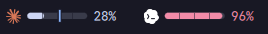
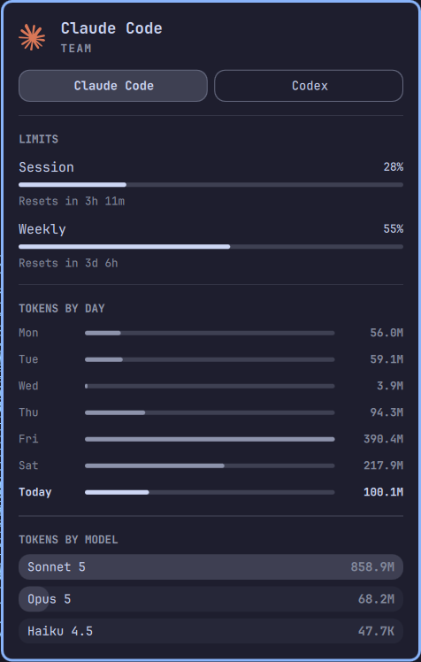
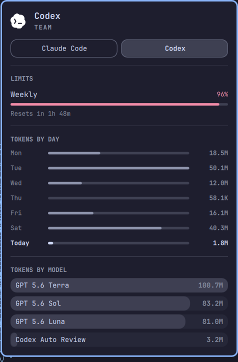

# Agent Usage Plus






Native Omarchy bar widget for AI coding usage, limits, balances, pace, costs
and history. It reads Omarchy and local collector records, so it works with
both subscriptions and API accounts without storing credentials.

Requires Omarchy with Quickshell plugin support; the plugin itself has no
other runtime dependencies. Optional collector dependencies and setup are
documented in [collector setup](collectors/README.md).

## Install

```bash
omarchy plugin add https://github.com/viganogabriele/agent-usage-plus.git --enable
```

## Update

```bash
omarchy plugin update io.github.viganogabriele.agent-usage-plus
```

## Remove

```bash
omarchy plugin remove io.github.viganogabriele.agent-usage-plus
```

## Providers

Claude Code, Codex, Fireworks, OpenRouter, DeepSeek, Gemini, Cursor, Kimi,
xAI/Grok and Z.AI/GLM.

Claude Code and Codex use Omarchy's built-in records. The other providers are
optional collectors:

```bash
./collectors/install.sh
~/.local/share/agent-usage-plus-collectors/bin/agent-usage-plus-collectors update
```

The widget follows Omarchy's live theme. Warn is fixed amber (`#F2B705`), and
notifications are off by default; when enabled, each provider alerts once at
Warn and once at Critical.

More: [collector setup](collectors/README.md), [record contract](docs/collector-contract.md),
[manual QA](docs/manual-qa.md), [troubleshooting](docs/troubleshooting.md) and
[contributing](CONTRIBUTING.md).

MIT licensed; see [LICENSE](LICENSE).
